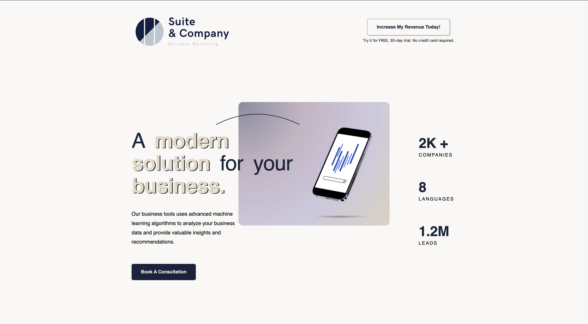

# Frontend Mentor - Space tourism website solution

This is a solution to the [Business Application Challange](https://www.frontendmentor.io/challenges/suite-landing-page-tj_eaU-Ra3). Frontend Mentor challenges help you improve your coding skills by building realistic projects. 

## Table of contents

- [Overview](#overview)
  - [The challenge](#the-challenge)
  - [Screenshot](#screenshot)
- [My process](#my-process)
  - [Built with](#built-with)
  - [What I learned](#what-i-learned)
  - [Continued development](#continued-development)
  - [Useful resources](#useful-resources)
- [Author](#author)
- [Acknowledgments](#acknowledgments)


## Overview

### The challenge

I was task with building this website and coming up with a new design idea.

### Screenshot




## My process

### Built with

- Semantic HTML5 markup
- CSS custom properties
  - Flexbox
  - CSS Grid
- Mobile-first workflow


### What I learned

While learning on this project, I learn how to add more than one value for the filter property and got to play around with animations. In terms of designing, I learn how to better plan for each project before starting on a design.


<code>

```` CSS
.text-arch {
    transform: translateX(6.875rem) scale(0.7) translateY(0.3125rem);
  }

   filter: invert(100%) drop-shadow(3px 2px var(--black));
</code>


### Continued development

In the future I would like to focus on incorporating JS into all my project and get more familiar and comfortable with it. I am starting the Odin and will continue to work on projects that are more JavaScript focus. I want to improve my project planning skills by taking the time to understand what is that I am creating before starting a project. That would allow me to have a more consistent feel in all of my project moving forward.


## Author

- Website - [Genesis](https://chipper-kitsune-ed0e41.netlify.app/)
- Frontend Mentor - [@codewithgen](https://www.frontendmentor.io/profile/codewithgen)

